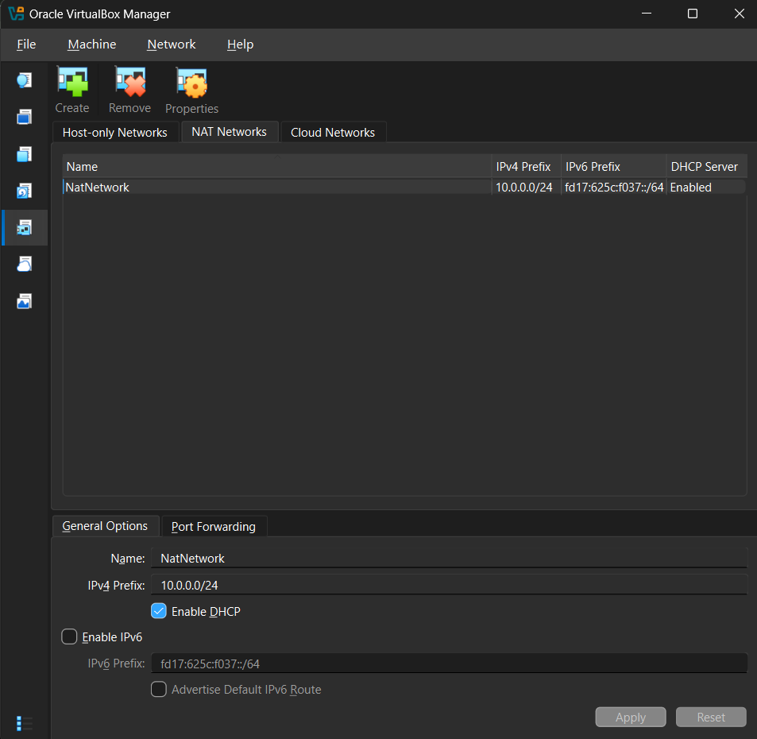
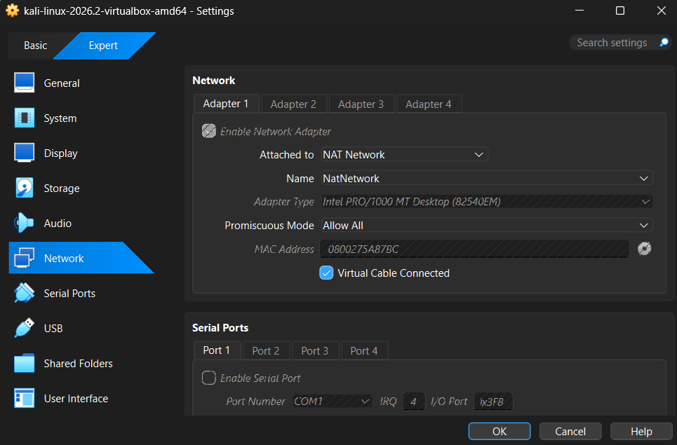
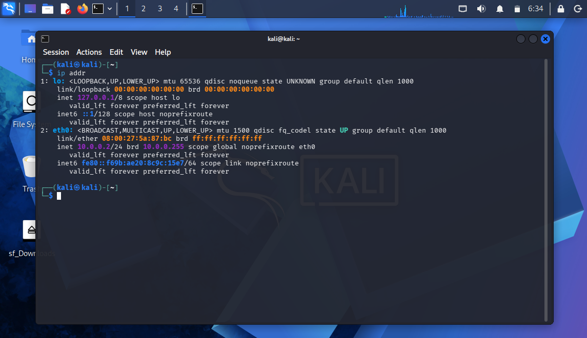
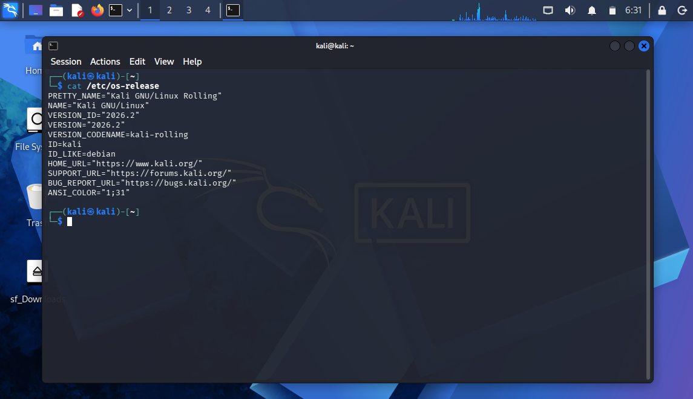
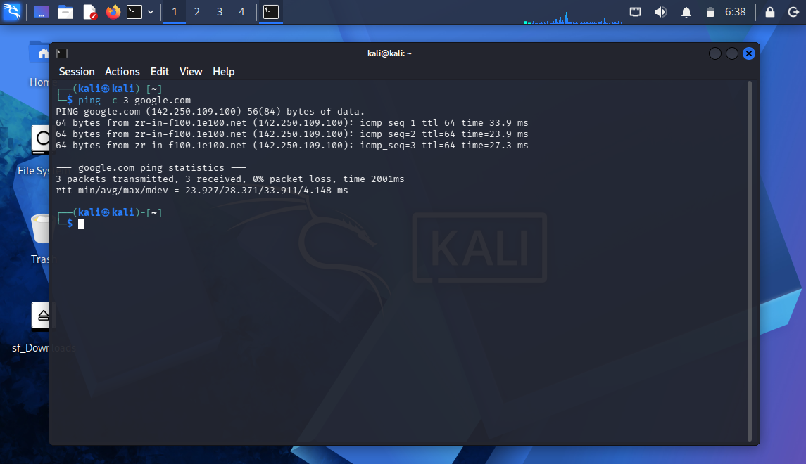
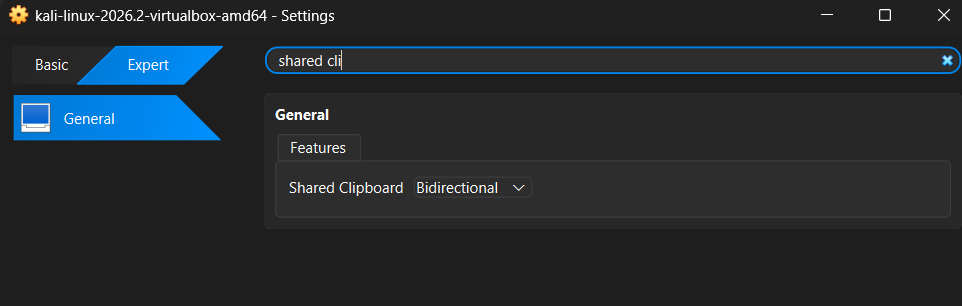
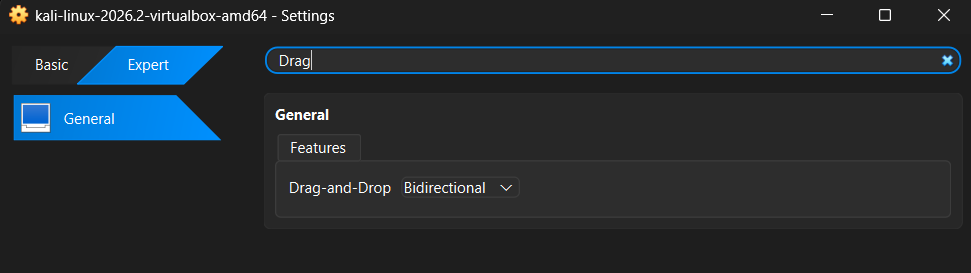
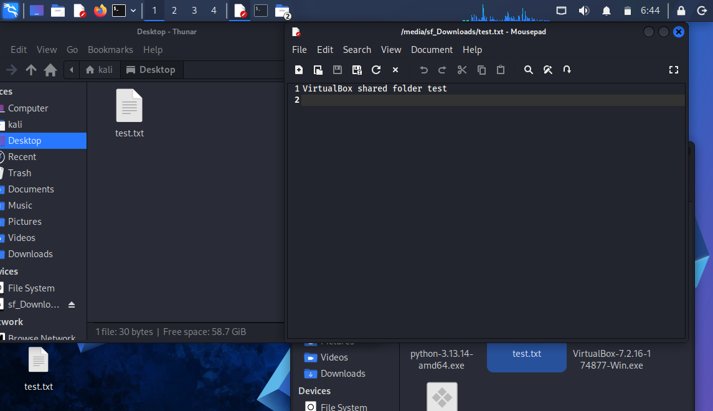
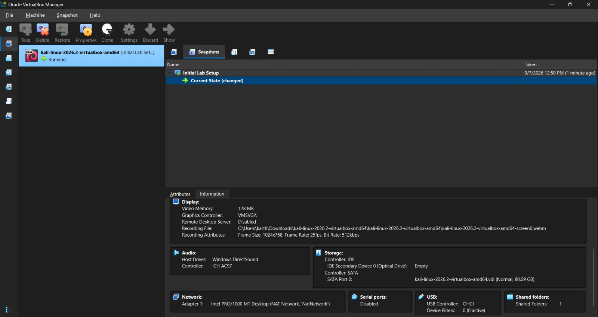

# 🛡️ Cybersecurity Testing Lab Setup

This repository documents the setup of a personal cybersecurity/ethical-hacking practice lab built with Oracle VirtualBox and Kali Linux, following the WK1-PM1 assignment from Network Walks Academy.

## Project Objective

The goal of this project was to build an isolated virtual lab environment that can later be used for ethical-hacking practice. The lab uses VirtualBox as the hypervisor and Kali Linux as the attacking/testing machine, running on a private NAT Network so the VM has controlled internet access without being exposed to my home network directly.

## Host System Specifications

| Component | Details |
|---|---|
| CPU | AMD Ryzen 7 260 w/ Radeon 780M, 3.80 GHz |
| RAM | 24 GB, 5600 MT/s |
| Graphics | 8 GB (Windows reports multiple GPUs installed) |
| Storage | 1 TB SSD |

## Tools & Technologies

- Windows (host OS)
- Oracle VirtualBox
- Kali Linux 2026.2

## 🌐 Network Architecture

The lab uses a custom VirtualBox **NAT Network** rather than the default NAT adapter, which allows the VM to reach the internet through a private, isolated subnet.

| Setting | Value |
|---|---|
| Network Name | `NatNetwork` |
| IPv4 Prefix | `10.0.0.0/24` |
| DHCP Server | Enabled |


**Figure 1 — NAT Network configuration:** The VirtualBox NAT Network `NatNetwork` is configured with the `10.0.0.0/24` IPv4 prefix and DHCP enabled, matching the subnet required by the assignment.

## Kali Linux VM Configuration

The Kali VM's Adapter 1 is attached to the custom NAT Network created above, with the virtual cable connected so the VM has an active link.


**Figure 2 — Kali VM network settings:** Adapter 1 is enabled and attached to **NAT Network**, using the `NatNetwork` network, with the virtual cable connected.

## IP Configuration

Running `ip addr` inside the Kali VM confirms the assigned IP address on the `eth0` interface.


**Figure 3 — Kali IP configuration:** `eth0` is assigned `10.0.0.2/24`, exactly matching the IP address required by the assignment.

## Kali Linux Environment

The Kali VM is running Kali Linux 2026.2 (Kali Rolling), confirmed via `/etc/os-release` inside the VM.


**Figure 4 — Kali Linux version:** Output of `cat /etc/os-release` confirms `VERSION_ID="2026.2"` on Kali GNU/Linux Rolling.

## 🌍 Internet Connectivity Test

A ping test to `google.com` was run from the Kali terminal to confirm outbound internet access through the NAT Network.


**Figure 5 — Internet connectivity test:** `ping -c 3 google.com` shows 3 packets transmitted, 3 received, 0% packet loss — confirming full internet connectivity from the Kali VM.

## 📂 Shared Folder Configuration

A shared folder was configured between the host and the Kali VM. Inside Kali it is mounted as `sf_Downloads`. To verify it, a test file (`test.txt`, containing `VirtualBox shared folder test`) was created and placed in the shared location.


**Figure 6 — Shared folder test:** `test.txt` is visible and readable inside the Kali VM at `/media/sf_Downloads`, confirming the host-to-VM shared folder is working correctly.

## Clipboard & Drag-and-Drop

Both Shared Clipboard and Drag-and-Drop were set to **Bidirectional** in the VM's General settings, allowing copy/paste and file transfer in both directions between host and guest.


**Figure 7 — Shared Clipboard:** Set to **Bidirectional** in the VM's General settings.


**Figure 8 — Drag-and-Drop:** Set to **Bidirectional** in the VM's General settings.

## Troubleshooting

### Problem
After initial setup, the Kali VM experienced a network connectivity issue related to `Wired connection 1` on the NAT Network adapter.

### Investigation
The network connection settings inside Kali were checked, and the issue was addressed directly from the Kali terminal rather than through the GUI.

### Solution
The connection was reset using the following commands, run directly from the Kali terminal:

```bash
sudo nmcli connection modify "Wired connection 1" ipv4.dad-timeout 0
sudo nmcli connection down "Wired connection 1"
sudo nmcli connection up "Wired connection 1"
```

### Result
After bringing the connection back up, connectivity was restored — confirmed by the successful `ping -c 3 google.com` test shown above (0% packet loss).

## 📸 VM Snapshot

A snapshot named **Initial Lab Setup** was taken once the base configuration (network, shared folder, clipboard, drag-and-drop) was complete, to preserve a clean rollback point.


**Figure 9 — VM snapshot:** The `Initial Lab Setup` snapshot is visible in the VirtualBox Manager for the `kali-linux-2026.2-virtualbox-amd64` VM.

## What I Learned

This project gave me hands-on experience setting up an isolated virtual lab environment from scratch. I learned how VirtualBox NAT Networks differ from the default NAT adapter, and why an isolated custom subnet is useful for a testing lab. Configuring the Kali VM's network adapter and manually verifying its IP address helped me understand how virtual networking is wired up under the hood. I also got practical experience with VirtualBox integration features like shared folders and bidirectional clipboard/drag-and-drop, which make working between the host and guest much easier. Troubleshooting the "Wired connection 1" issue via the Kali terminal (using `nmcli`) was a useful introduction to managing network connections from the command line instead of relying on the GUI. Finally, taking a snapshot after completing the base setup taught me the value of having a clean rollback point before making further changes to the VM.

## Conclusion

This lab successfully sets up an isolated VirtualBox NAT Network environment with a fully configured Kali Linux VM, matching the requirements of the WK1-PM1 assignment: correct subnet, correct Kali IP, working internet access, shared folder, bidirectional clipboard/drag-and-drop, and a saved snapshot. It provides a solid, controlled foundation for future cybersecurity and ethical-hacking practice.

---

## Author

**Karthik Raman Keerangudi Kalyanaraman**
Cybersecurity Intern
Network Walks B083
LinkedIn: [www.linkedin.com/in/karthik-raman-k-k](https://www.linkedin.com/in/karthik-raman-k-k)

## Project Info

Program Name: Cybersecurity at Networkwalks | Week: 01 | Project: Cybersecurity Lab Setup | Repository: GitHub
